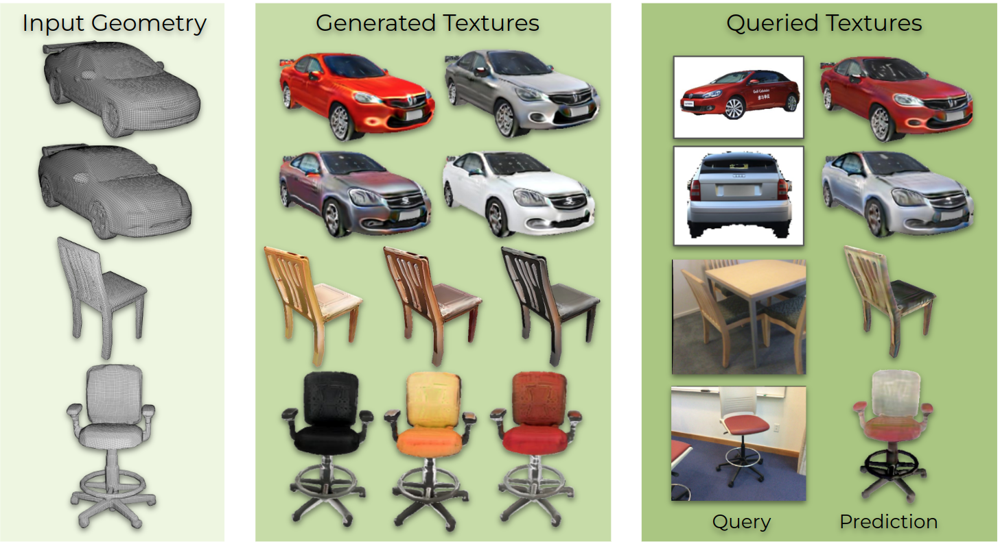

# Mesh2Tex: Generating Mesh Textures from Image Queries
### [Project Page](https://alexeybokhovkin.github.io/mesh2tex/) | [Paper](http://arxiv.org/abs/2304.05868) | [Video](https://youtu.be/tY6pPHN5v9Q)

Official PyTorch implementation of the paper

Remarkable advances have been achieved recently in learning neural representations that characterize object geometry, while generating textured objects suitable for downstream applications and 3D rendering remains at an early stage. In particular, reconstructing textured geometry from images of real objects is a significant challenge - reconstructed geometry is often inexact, making realistic texturing a significant challenge.

We present Mesh2Tex, which learns a realistic object texture manifold from uncorrelated collections of 3D object geometry and photorealistic RGB images, by leveraging a hybrid mesh-neural-field texture representation. Our texture representation enables compact encoding of high-resolution textures as a neural field in the barycentric coordinate system of the mesh faces.

The learned texture manifold enables effective navigation to generate an object texture for a given 3D object geometry that matches to an input RGB image, which maintains robustness even under challenging real-world scenarios where the mesh geometry approximates an inexact match to the underlying geometry in the RGB image. Mesh2Tex can effectively generate realistic object textures for an object mesh to match real images observations towards digitization of real environments, significantly improving over previous state of the art.

 

### Source Code Coming Soon!

## Citation
If you find our work useful in your research, please consider citing:

	@misc{bokhovkin2023mesh2tex,
		title={Mesh2Tex: Generating Mesh Textures from Image Queries}, 
		author={Bokhovkin, Alexey and Tulsiani, Shubham and Dai, Angela},
		journal={2023 IEEE/CVF International Conference on Computer Vision (ICCV)},
		year={2023}
	}
