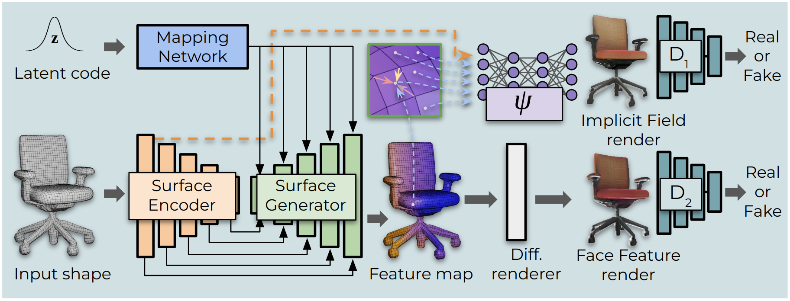
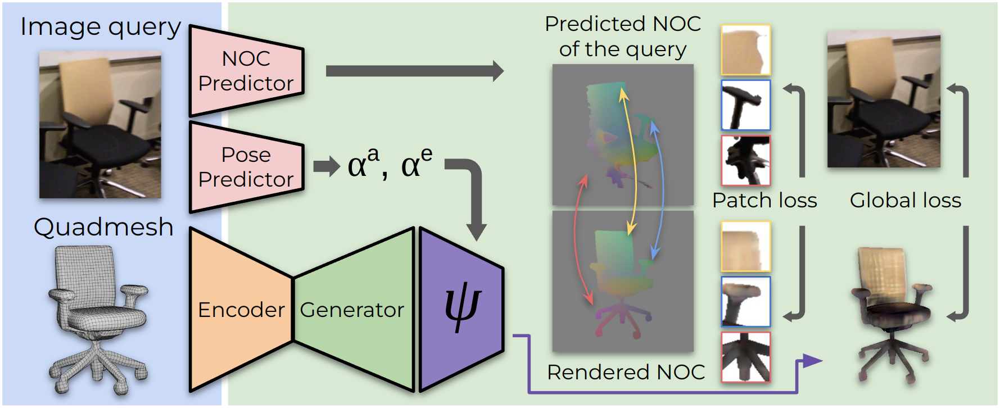

# Mesh2Tex: Generating Mesh Textures from Image Queries
### [Project Page](https://alexeybokhovkin.github.io/mesh2tex/) | [Paper](http://arxiv.org/abs/2304.05868) | [Video](https://youtu.be/tY6pPHN5v9Q)

Official PyTorch implementation of the paper


Remarkable advances have been achieved recently in learning neural representations that characterize object geometry, while generating textured objects suitable for downstream applications and 3D rendering remains at an early stage. In particular, reconstructing textured geometry from images of real objects is a significant challenge - reconstructed geometry is often inexact, making realistic texturing a significant challenge.

We present Mesh2Tex, which learns a realistic object texture manifold from uncorrelated collections of 3D object geometry and photorealistic RGB images, by leveraging a hybrid mesh-neural-field texture representation. Our texture representation enables compact encoding of high-resolution textures as a neural field in the barycentric coordinate system of the mesh faces.

The learned texture manifold enables effective navigation to generate an object texture for a given 3D object geometry that matches to an input RGB image, which maintains robustness even under challenging real-world scenarios where the mesh geometry approximates an inexact match to the underlying geometry in the RGB image. Mesh2Tex can effectively generate realistic object textures for an object mesh to match real images observations towards digitization of real environments, significantly improving over previous state of the art.

<br>

## Method Overview





## Dependencies

The installation process is similar to the [Texturify](https://nihalsid.github.io/texturify/) project.

Install main python requirements & PyTorch 1.11.0 for Cuda 11.3 (or other suitable version):

```commandline
pip install -r requirements.txt
pip install torch==1.11.0+cu113 torchvision==0.12.0+cu113 torchaudio==0.11.0 --extra-index-url https://download.pytorch.org/whl/cu113
```

Install trimesh from the following fork (for quadmesh processing):
```bash
cd ~
git clone git@github.com:nihalsid/trimesh.git
cd trimesh
python setup.py install
```

We use `nvdiffrast` and `PyTorch3D` for differentiable rendering. You'll need to install first `nvdiffrast` dependencies:

```bash
sudo apt-get update && sudo apt-get install -y --no-install-recommends \
    pkg-config \
    libglvnd0 \
    libgl1 \
    libglx0 \
    libegl1 \
    libgles2 \
    libglvnd-dev \
    libgl1-mesa-dev \
    libegl1-mesa-dev \
    libgles2-mesa-dev \
    cmake \
    curl
```

Install `nvdiffrast` from official source:

```bash
cd ~ 
git clone git@github.com:NVlabs/nvdiffrast.git
cd nvdiffrast
pip install .
```

Install PyTorch3D with GPU support:

```bash
pip install iopath
pip install --no-index --no-cache-dir pytorch3d -f https://dl.fbaipublicfiles.com/pytorch3d/packaging/wheels/py38_cu113_pyt1110/download.html
```

Apart from this, you will need approporiate versions of torch-scatter, torch-sparse, torch-spline-conv, torch-geometric, depending on your torch+cuda combination. E.g. for torch-1.11 + cuda11.3 you'd need:  

```commandline
pip install torch-scatter torch-sparse torch-cluster torch-spline-conv torch-geometric -f https://data.pyg.org/whl/torch-1.11.0+cu113.html
```

## Dataset

Similar to the [Texturify](https://nihalsid.github.io/texturify/) project, the data can be processed using https://github.com/nihalsid/CADTextures

## Training & Experiments

There several stages in Mesh2Tex that include training and test-time optimization.

### Training texturing models

Modify corresponding config files: `config/stylegan2.yaml` and `config/stylegan2_car.yaml`.

```commandline
cd scripts
./train_chairs_mlprender.sh
```

```commandline
cd scripts
./train_cars_mlprender.sh
```

### Training pose prediction models

Modify corresponding config files: `config/chair_pose.yaml` and `config/car_pose.yaml`.

```commandline
cd scripts
./train_chair_pose.sh
```

```commandline
cd scripts
./train_car_pose.sh
```

### Training NOCs prediction models

Modify corresponding config files: `config/chair_nocs.yaml` and `config/car_nocs.yaml`.

Store NOCs first before training models (for ShapeNet and ScanNet datasets):

```commandline
cd scripts
./store_nocs_chairs.sh
```

```commandline
cd scripts
./store_nocs_cars.sh
```

Train NOCs models:

```commandline
cd scripts
./train_chair_nocs.sh
```

```commandline
cd scripts
./train_car_nocs.sh
```

Store NOCs after that to use at test-time optimization (change `config.mode` to `'store'`):

```commandline
cd scripts
./train_chair_nocs.sh
```

```commandline
cd scripts
./train_car_nocs.sh
```

### Optimizing chair/car textures

Modify corresponding config files: `config/stylegan2.yaml` and `config/stylegan2_car.yaml`.

```commandline
cd scripts
./optimize_chairs.sh
```

```commandline
cd scripts
./optimize_cars.sh
```

## Checkpoints

Checkpoints for texturing, pose and NOCs prediction can be downloaded from [here](https://drive.google.com/file/d/16b8DNhcC5gfwDC2_jDSJ_AS_G3BzOkNu/view?usp=sharing).

## Citation
If you find our work useful in your research, please consider citing:

	@misc{bokhovkin2023mesh2tex,
		title={Mesh2Tex: Generating Mesh Textures from Image Queries}, 
		author={Bokhovkin, Alexey and Tulsiani, Shubham and Dai, Angela},
		journal={2023 IEEE/CVF International Conference on Computer Vision (ICCV)},
		year={2023}
	}

Official Texturify code and paper:

	@inproceedings{siddiqui2022texturify,
		author    = {Yawar Siddiqui and
					Justus Thies and
					Fangchang Ma and
					Qi Shan and
					Matthias Nie{\ss}ner and
					Angela Dai},
		title     = {Texturify: Generating Textures on 3D Shape Surfaces},
		booktitle = {Computer Vision - {ECCV} 2022 - 17th European Conference, Tel Aviv,
					Israel, October 23-27, 2022, Proceedings, Part {III}},
		series    = {Lecture Notes in Computer Science},
		volume    = {13663},
		pages     = {72--88},
		publisher = {Springer},
		year      = {2022}
	}

## License

Copyright © 2023 alexeybokhovkin

Permission is hereby granted, free of charge, to any person obtaining a copy of this software and associated documentation files (the “Software”), to deal in the Software without restriction, including without limitation the rights to use, copy, modify, merge, publish, distribute, sublicense, and/or sell copies of the Software, and to permit persons to whom the Software is furnished to do so, subject to the following conditions:

The above copyright notice and this permission notice shall be included in all copies or substantial portions of the Software.

THE SOFTWARE IS PROVIDED “AS IS”, WITHOUT WARRANTY OF ANY KIND, EXPRESS OR IMPLIED, INCLUDING BUT NOT LIMITED TO THE WARRANTIES OF MERCHANTABILITY, FITNESS FOR A PARTICULAR PURPOSE AND NONINFRINGEMENT. IN NO EVENT SHALL THE AUTHORS OR COPYRIGHT HOLDERS BE LIABLE FOR ANY CLAIM, DAMAGES OR OTHER LIABILITY, WHETHER IN AN ACTION OF CONTRACT, TORT OR OTHERWISE, ARISING FROM, OUT OF OR IN CONNECTION WITH THE SOFTWARE OR THE USE OR OTHER DEALINGS IN THE SOFTWARE.